> SPDX-License-Identifier: MPL-2.0
> Copyright © 2026 Cristian Camargo Filho


# Harness Lens for VS Code

Sibling repository for HarnessLens editor integration and reusable VS Code-facing discovery package.

> **Status:** early preview. The Marketplace extension provides discovery,
> navigation, and a client for the external Rust language server.

## Published identities

- GitHub repository: `harness-lens/harness-lens-vscode`
- npm package: `@harness-lens/vscode`
- Marketplace extension name: `harness-lens`
- Canonical VS Code extension ID: `harness-lens.harness-lens`
- Display name: `Harness Lens`
- Marketplace publisher: `harness-lens`
- Marketplace lifecycle: `0.0.1` published; `0.0.2` prepared as Preview

VS Code forms the canonical extension ID as `<publisher>.<name>`. The unscoped Marketplace manifest and scoped npm package therefore use separate manifests in this repository.

## Structure

```text
harness-lens-vscode/
├── packages/
│   ├── extension/   # Marketplace extension: harness-lens.harness-lens
│   └── vscode/      # npm package: @harness-lens/vscode
├── docs/
├── scripts/
└── .github/
```

## Pipeline Flow

```mermaid
flowchart TD

subgraph group_discovery["Discovery"]
  node_discovery_api["Harness discovery API<br/>[index.ts]"]
end

subgraph group_editor["VS Code Extension"]
  node_extension["Extension controller<br/>[extension.ts]"]
  node_settings["Provider settings"]
  node_server_path["Server resolver"]
end

subgraph group_evidence["Evidence Services"]
  node_provider_service["Provider protocol"]
  node_observed_service["Observed-flow protocol"]
end

subgraph group_presentation["Observability UI"]
  node_center["Observability center<br/>[center.ts]"]
  node_model["Report and history model<br/>[center-model.ts]"]
  node_view["Metrics center view<br/>[center-view.ts]"]
end

node_developer(("Developer"))
node_workspace["Workspace files"]
node_vscode["VS Code"]
node_language_server["Harness language server"]
node_codeburn["CodeBurn provider"]

node_developer -->|"uses"| node_vscode
node_vscode -->|"activates"| node_extension
node_extension -->|"classifies paths"| node_discovery_api
node_workspace -->|"scans and opens"| node_extension
node_extension -->|"resolves command"| node_server_path
node_extension -->|"resolves policy"| node_settings
node_extension -->|"starts"| node_language_server
node_extension -->|"opens and refreshes"| node_center
node_extension -->|"requests catalog"| node_provider_service
node_extension -->|"requests flow"| node_observed_service
node_provider_service -->|"sends protocol requests"| node_language_server
node_observed_service -->|"requests flow data"| node_language_server
node_center -->|"validates and summarizes"| node_model
node_center -->|"renders reports"| node_view
node_center -->|"requests workspace evidence"| node_language_server
node_center -->|"stores history locally"| node_vscode
node_language_server -.->|"optionally obtains runtime evidence"| node_codeburn
node_settings -->|"initializes provider policy"| node_language_server

click node_discovery_api "https://github.com/harness-lens/harness-lens-vscode/blob/main/packages/vscode/src/index.ts"
click node_extension "https://github.com/harness-lens/harness-lens-vscode/blob/main/packages/extension/src/extension.ts"
click node_settings "https://github.com/harness-lens/harness-lens-vscode/blob/main/packages/extension/src/provider-settings.ts"
click node_server_path "https://github.com/harness-lens/harness-lens-vscode/blob/main/packages/extension/src/language-server-path.ts"
click node_provider_service "https://github.com/harness-lens/harness-lens-vscode/blob/main/packages/extension/src/provider-service.ts"
click node_observed_service "https://github.com/harness-lens/harness-lens-vscode/blob/main/packages/extension/src/observed-flow-service.ts"
click node_center "https://github.com/harness-lens/harness-lens-vscode/blob/main/packages/extension/src/center.ts"
click node_model "https://github.com/harness-lens/harness-lens-vscode/blob/main/packages/extension/src/center-model.ts"
click node_view "https://github.com/harness-lens/harness-lens-vscode/blob/main/packages/extension/src/center-view.ts"

classDef toneNeutral fill:#f8fafc,stroke:#334155,stroke-width:1.5px,color:#0f172a
classDef toneBlue fill:#dbeafe,stroke:#2563eb,stroke-width:1.5px,color:#172554
classDef toneAmber fill:#fef3c7,stroke:#d97706,stroke-width:1.5px,color:#78350f
classDef toneMint fill:#dcfce7,stroke:#16a34a,stroke-width:1.5px,color:#14532d
classDef toneRose fill:#ffe4e6,stroke:#e11d48,stroke-width:1.5px,color:#881337
classDef toneIndigo fill:#e0e7ff,stroke:#4f46e5,stroke-width:1.5px,color:#312e81
classDef toneTeal fill:#ccfbf1,stroke:#0f766e,stroke-width:1.5px,color:#134e4a
class node_discovery_api toneBlue
class node_extension,node_settings,node_server_path toneAmber
class node_provider_service,node_observed_service,node_language_server toneMint
class node_center,node_model,node_view toneRose
class node_developer,node_workspace,node_vscode,node_codeburn toneIndigo
```



## Current behavior

The npm package discovers supported agent harness files from Node.js. The VS Code
extension adds **Harness Lens: Scan Workspace**, displays discovered file count,
opens selected harness files, and starts `harness-lens-lsp` when a harness file
is present. Standard diagnostics are compatible with VS Code's Problems view and
extensions such as Error Lens. Its Activity Bar view and metrics center expose
content-safe workspace reports, per-file context and configured input cost,
findings, score methods, plugin execution, and local comparison history.
Compatible servers can also supply provider-neutral observed action flow. The
metrics center renders only measured adjacent transitions as a local CSP-safe
Sankey plus a keyboard-accessible table; a bounded per-turn token lens below it
shows measured or explicitly estimated input/output usage, cached input,
attributed cost, and explicit gaps. Static relationships stay in the tree.

Optional aggregate runtime evidence supports explicit `off`, `live`, and
`snapshot` modes. CodeBurn provider and runtime mode both default off for each
VS Code window; selecting `live` alone cannot launch it. Enable provider
explicitly with **Harness Lens:
Enable CodeBurn Provider**, then select a runtime mode. File effectiveness and
tool-call history stay visibly unmeasured until sanitized attributable evidence
is available. Static token-cost estimates are never presented as observed model
or tool spend.

Editor sends explicit trust, virtual-workspace, and selected-provider state to
language server initialization. The enable flow validates the schema-versioned
provider catalog, and the metrics center validates aggregate responses before
use. CodeBurn remains optional, separately installed, MIT-licensed, and
unbundled; extension never downloads, installs, or updates it.

Observed flow is independently consent-controlled. Set
`harnessLens.observedFlow.mode` to `snapshot` and configure
`harnessLens.observedFlow.snapshotPath` with deny-by-default sanitized action
trace JSON. The extension does not analyze or persist the trace. It validates
the bounded LSP graph response, exposes metric unit, filtered denominator,
share, sample size, window, provenance, completeness, and filters, and keeps
unavailable evidence distinct from zero activity. The synchronized turn slider
highlights the corresponding layered Sankey action without inferring usage from
static file estimates.

Windows users can install the VSIX and matching native language server together
with the [coordinated installer](docs/windows-installation.md). The extension
automatically discovers its server under `%LOCALAPPDATA%\HarnessLens\bin`.

Install the server from a checkout of the
[`language-server`](https://github.com/harness-lens/language-server) repository:

```bash
cargo install --path rust
```

If it is not on `PATH`, set `harnessLens.languageServer.path` to its absolute
location. Server execution is disabled in untrusted and virtual workspaces.

## Ecosystem

- [Core](https://github.com/harness-lens/core)
- [SDK](https://github.com/harness-lens/sdk)
- [CLI](https://github.com/harness-lens/cli)
- [Language Server](https://github.com/harness-lens/language-server)
- [Project hub](https://github.com/harness-lens/harness-lens)

Supported files:

- `AGENTS.md`
- `AGENTS.override.md`
- `CLAUDE.md` and `CLAUDE.local.md`
- `GEMINI.md`
- `SKILL.md`, including `.agents/skills/` and `.claude/skills/`
- GitHub Copilot instructions and `.github/agents/*.agent.md`
- Claude agents and rules under `.claude/`
- Codex config, agents, and rules under `.codex/`
- compatible rules under `.agents/rules/` and `.cursor/rules/`

See the [Windows installation and configuration](docs/windows-installation.md),
[product tour](docs/product-tour.md), and [manual source-build guide](docs/manual-installation.md).

## Development

```bash
npm ci
npm run check
npm test
npm run package
```

Artifacts are written to `artifacts/`:

- npm tarball for `@harness-lens/vscode`
- installable `harness-lens.vsix`

See [publishing setup](docs/publishing.md), [ecosystem plan](docs/ecosystem.md),
and the central [registry and administration map](https://github.com/harness-lens/harness-lens/blob/main/docs/registry-and-administration.md).

## License

Early namespace-reservation versions used BSD-3-Clause. The official functional
implementation is licensed under MPL-2.0. When Covered Software is distributed,
modified MPL-covered files must remain available in Source Code Form under the
license. See [LICENSING](LICENSING.md), [COPYRIGHT](COPYRIGHT), and
[TRADEMARKS](TRADEMARKS).

## Completion plan

See [observability completion](docs/observability-completion.md) for the current
dedicated editor interface, remaining runtime-history and attribution work,
and dependency-ordered verification and publication gates.
