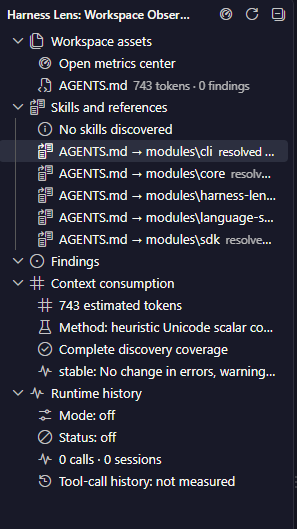
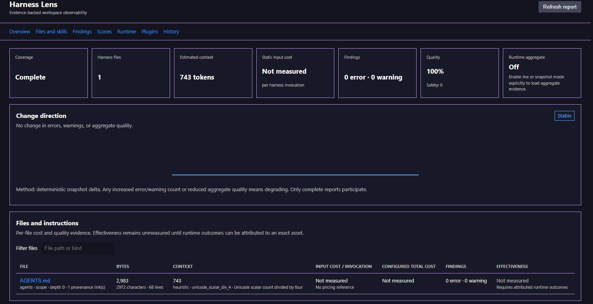
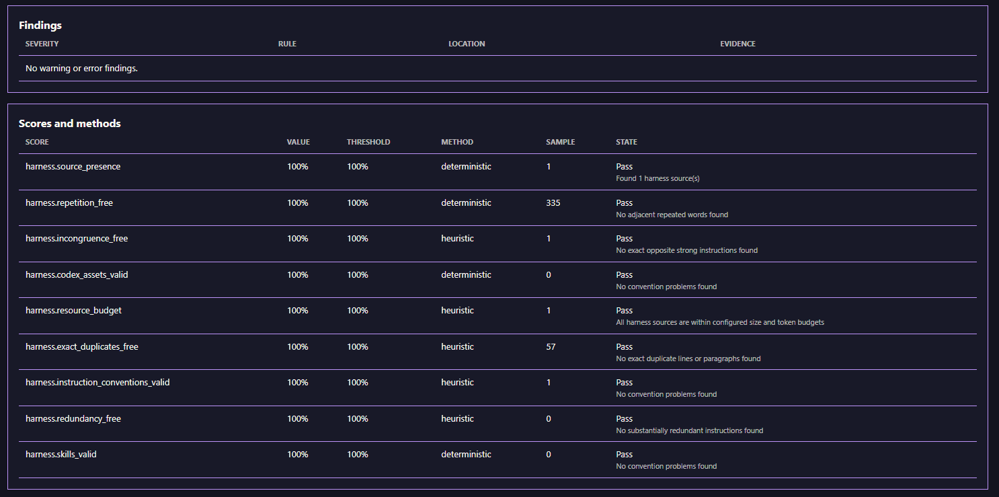
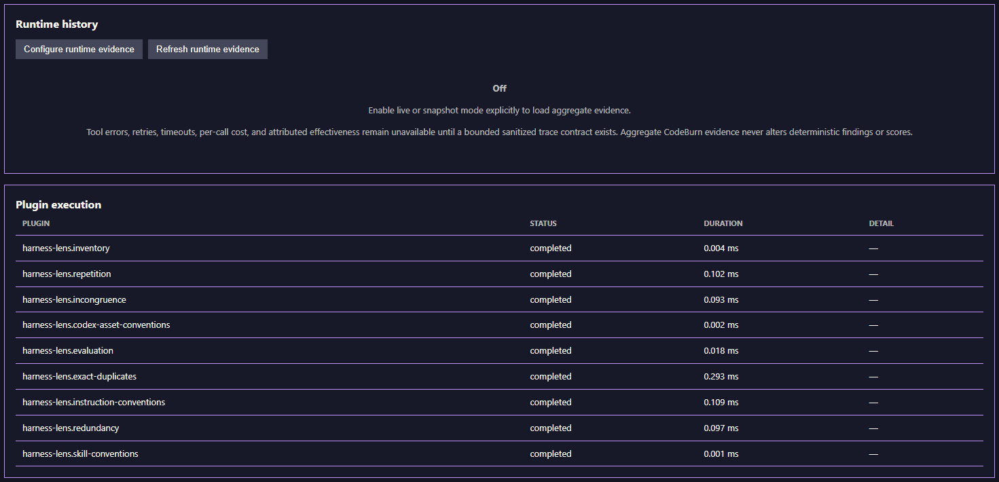
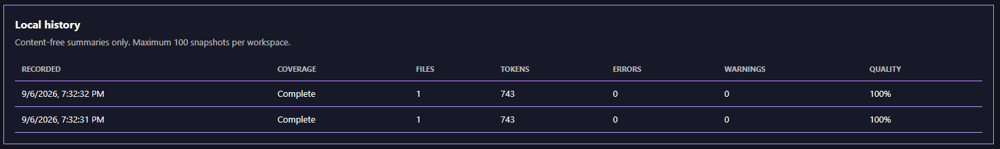
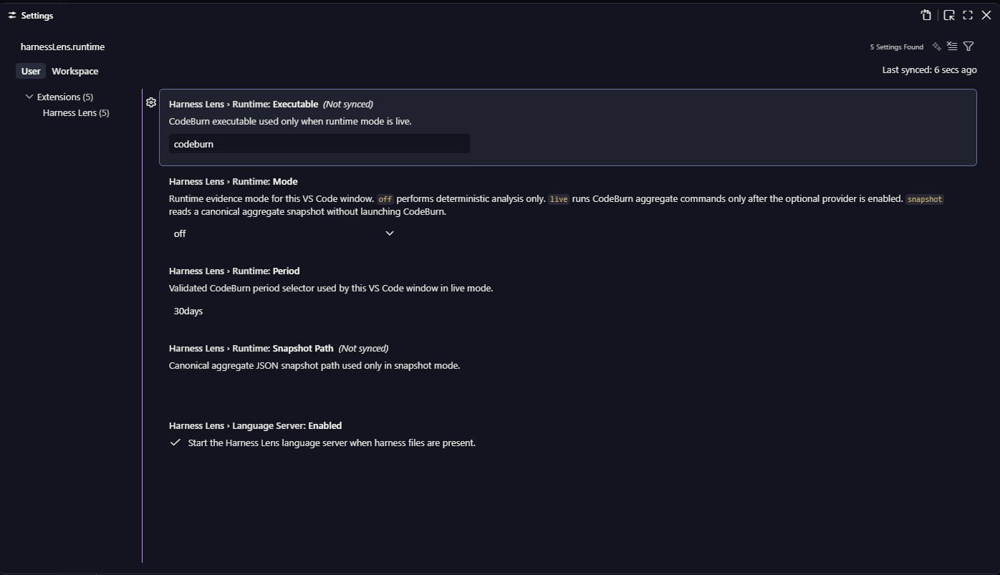

<!-- SPDX-License-Identifier: MPL-2.0 -->
<!-- Copyright © 2026 Cristian Camargo Filho -->

# Product tour

These captures show the current early-preview extension running against a
complete local workspace report. Reports contain paths, counts, aggregate
metrics, and bounded evidence; they do not serialize source text or secrets.

## Workspace Observer

The Activity Bar view groups workspace assets, skills and references, findings,
context consumption, and runtime status. File references open in the editor;
directory references are revealed in Explorer.

## Metrics overview

The metrics center reports coverage, discovered files, estimated context,
configured input cost, findings, quality, runtime state, and deterministic
change direction.

## Findings and score methods

Each score exposes its normalized value, threshold, method, sample size, state,
and reason. Safety violations stay separate from the quality average.

## Runtime and plugin execution

Optional runtime evidence starts off. Plugin execution remains observable with
status, duration, and failure detail.

## Local history

The extension keeps up to 100 content-free summaries per workspace for local
comparison.

## Runtime settings

VS Code settings control the optional executable, runtime mode, period,
snapshot, and language-server lifecycle.

